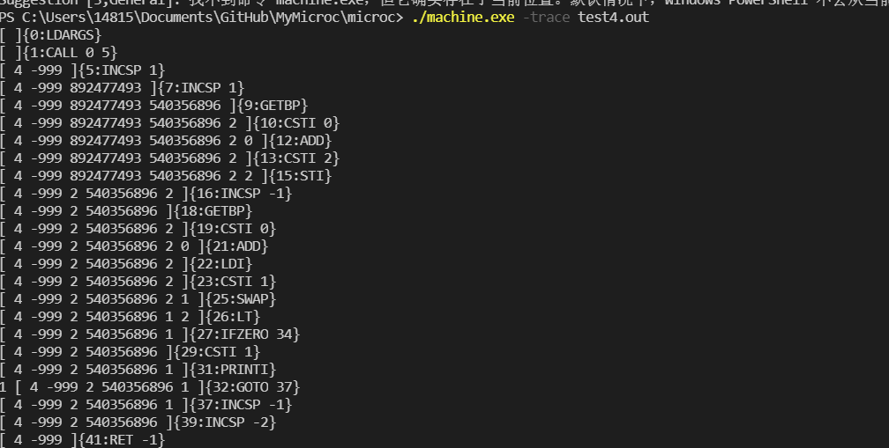

2020-2021学年第2学期

## 实 验 报 告

- 课程名称: <u>编程语言原理与编译</u>
- 实验项目: <u>编译原理大作业</u>
- 专业班级: <u>计算机1801</u>
- 学生学号: <u>31801062</u>
- 学生姓名: <u>柴巧霞</u>
- 实验指导教师:<u>郭鸣</u>
- GitHub：https://github.com/wxzhyyy/MyMicroc

---

## 简介

编译原理大作业，基于microc

## 项目说明

- 项目 是基于现有的microc代码
  - 自增功能
  - 算术赋值运算  
  - for循环
  - switch case
  - 三目运算

## 功能实现

- ### 自增自减

  - 
  
  - 语法树
  
    
  
  - 查看 栈帧 

- ### ++、--、+=、-=、*=、/=、%=

  - 
  - 
  - 查看 栈帧 
  
- For 循环

  - 
  - 
  - 
  - 查看 栈帧 

- 三目运算

  - 
  - 
  - 查看 栈帧 

- Switch case

  - 
  - 查看 栈帧 
  - 

| 姓名   | 学号     | 班级       | 任务 | 权重   |
| ------ | -------- | ---------- | ---- | ------ |
| Name   | No.      | Class      | Task | Factor |
| 柴巧霞 | 31801062 | 计算机1801 | 所有 | 1.0    |

|              |      |           |      |
| ------------ | ---- | --------- | ---- |
| 增加的功能   | 评分 | 测试代码  |      |
| 自增自减     | ⭐⭐⭐⭐ | testpre.c |      |
| 算术赋值运算 | ⭐⭐⭐⭐ | test2.c   |      |
| for循环      | ⭐⭐⭐⭐ | test3.c   |      |
| switch case  | ⭐⭐⭐  | test4,c   |      |
| 三目运算     | ⭐⭐⭐⭐ | test5.c   |      |

1. 心得体会（结合自己情况具体说明）

   - 大项目开发过程心得

     - 在本次大作业中，我只是对microc的语法部分进行了改变。增加了自增、算术赋值、for循环、switch语句以及三目运算等功能。我实现的功能都只能算是基础，只能针对语法、词法这些简单的进行修改。我在这门课的学习上还有很大的进步空间。
     - 一开始学习编译原理的时候，就没有很跟得上，随着课程的深入，内容越来越难以理解，都需要在课后花费大量的时间去查看资料，不断加深理解。左递归、右递归、栈式虚拟机、类型检查推导、F#和Ocaml的语法等等都需要在课后花费大量的时间去学习，去实践，才能完全理解。然而因为这学期其他课程大作业的挤压，再加上前期的不重视导致我最后开始大作业的时候，所留下的时间并不多，知识体系也不完备，所以完成的过程很艰难。不过随着不断的试错，也让我对microc和编译原理加深了理解。
       - 我们所需要编译的microc是小型的C语言，microc也是一种命令式语言，而命令式语言主要由表达式和语句构成。老师给我们的microc源码是用F#写的，用到了F#的两个模块，fslex词法扫描和fsyacc语法分析，通过这两个模块生成我们的词法扫描器和语法分析器。
       - 了解到C语言是如何使用存储模型，来修改内存中变量的值，通过变量名的映射到整数，再将存储看成是运行时的上下文环境。知道了求值表达式 eval expr 和 执行语句 exec stmt之间的区别对store内容的影响
       - 再者通过这次的大作业也彻底实践了一次语言编译解释的过程。

     